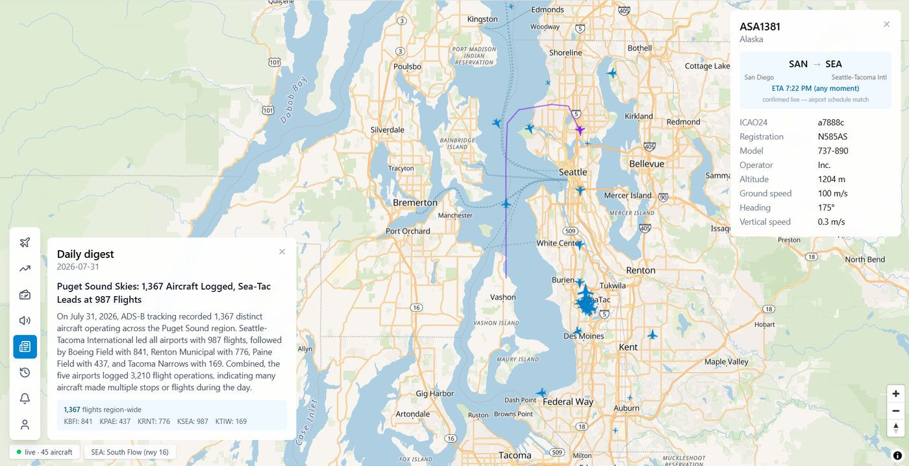
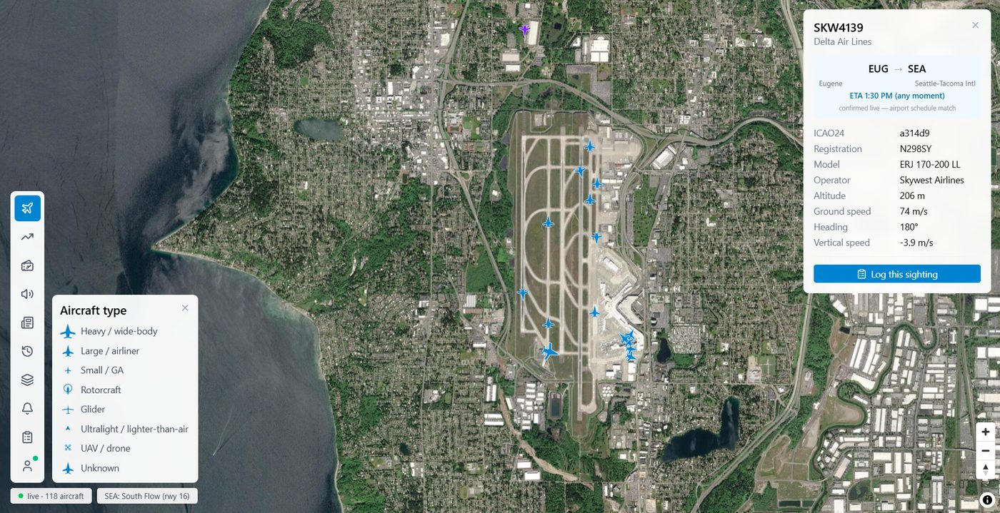
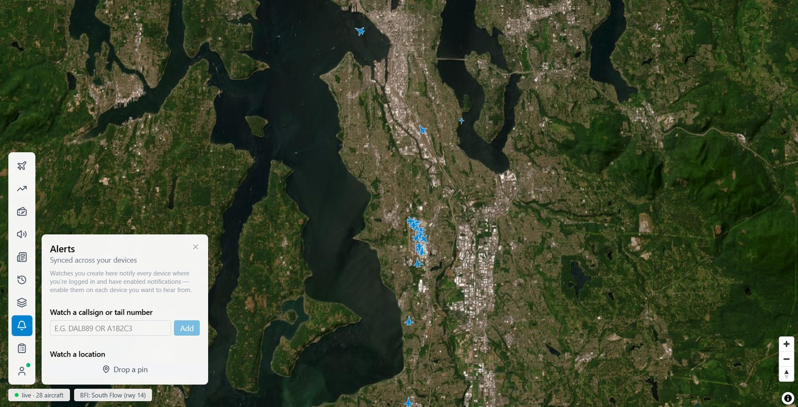
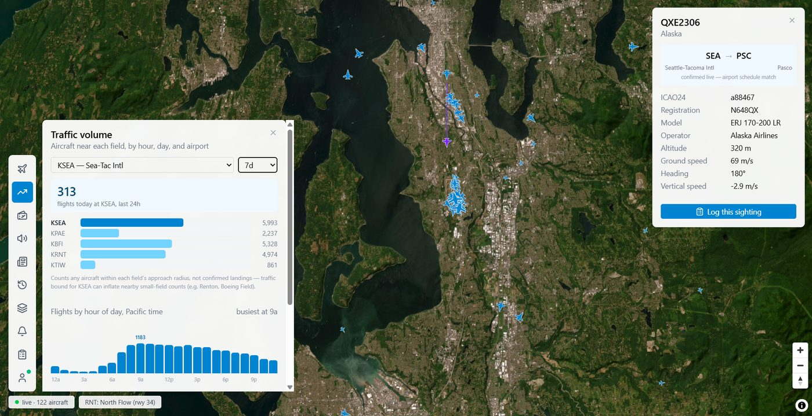
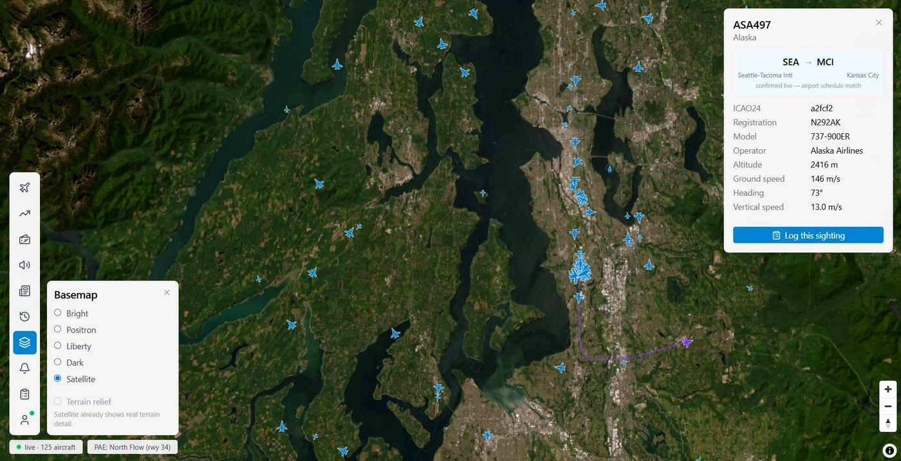
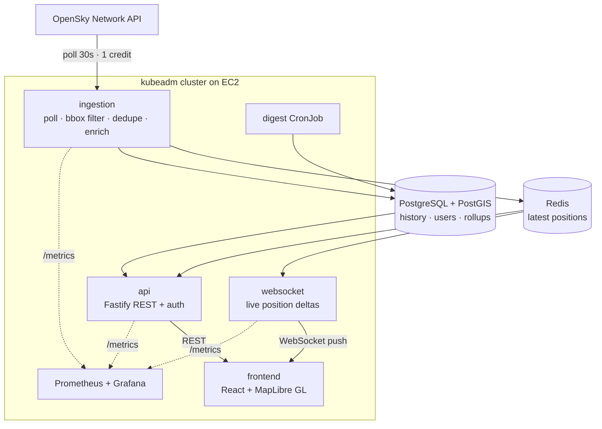

# PugetScope

**Real-time aviation tracking for the Puget Sound region.** Live ADS-B positions for
SEA, BFI, PAE, RNT, TIW, Whidbey NAS, and JBLM — pushed to the browser over WebSockets,
enriched with flight routes, and backed by continuously accumulating position history
that powers replay and analytics.

**Live at [pugetscope.com](https://pugetscope.com)** · Self-managed Kubernetes on EC2 · Terraform · Prometheus + Grafana



---

## What it does

- **Live map** — aircraft positions updated every 30s and pushed over WebSocket, no
  client polling. Heading-rotated SVG silhouettes per aircraft class, altitude coloring,
  position trails.
- **Flight detail** — callsign, registration, model, operator, altitude, speed, heading,
  vertical speed, plus **origin/destination and ETA** matched against live airport
  schedules.
- **Runway flow inference** — which configuration each field is using right now
  (`SEA: South Flow (rwy 16)`), derived from approach and departure headings in the
  position history rather than from any published feed.
- **Traffic analytics** — flights per hour, day, and airport, built on pre-aggregated
  rollup tables because the raw `positions` table got too large to query interactively.
- **Neighborhood overflight analytics** — overflights bucketed by neighborhood polygon,
  time of day, and altitude.
- **Historical replay** — scrub back through recorded position history.
- **Alerts** — watch a callsign, tail number, or map location; browser push notifications
  synced across devices.
- **Spotting log** — auth-gated, and confirmed against real ADS-B data rather than
  self-reported.
- **Daily digest** — LLM-generated regional summary over the day's aggregates.

| | |
|---|---|
|  |  |
| **Aircraft classification** — custom silhouettes per ADS-B class, route enrichment with live ETA | **Alerts** — callsign and location watches, delivered by browser push |
|  |  |
| **Traffic analytics** — flights per airport and per hour, served from pre-aggregated rollup tables | **Position history** — departure track drawn from stored positions, the same data behind replay and flow inference |

---

## Architecture

Four services, each an independent Kubernetes Deployment.



**Why ingestion is split from the API.** Ingestion is a long-lived, always-on polling
loop whose cadence is dictated by an external rate limit, not by user traffic. The API
scales with request load. Coupling them would mean user traffic spikes competing with
the feed for resources, and a deploy of one restarting the other. They share state
through Redis and Postgres and nothing else.

**Why Redis and Postgres both.** Redis holds only the current state of each aircraft —
what the map needs, read on every WebSocket tick. Postgres accumulates every position
report forever, which is what makes replay, traffic analytics, and runway-flow inference
possible from data already on disk rather than from new integrations.

---

## Engineering notes

Problems that turned out to be more interesting than expected:

**Rate limits shaped the architecture.** OpenSky's free tier allots 4,000 credits/day in
independent buckets. A bounding-box query under 25 sq° costs 1 credit; the Puget Sound
box is ~1.8 sq°. Polling every 30s spends 2,880/day and leaves headroom for retries. The
anonymous tier — 400/day — would have permitted one poll every 3.6 minutes, which is not
a live map. On `429`, the service reads `X-Rate-Limit-Retry-After-Seconds` and backs off
rather than guessing.

**The traffic endpoints hit a ceiling indexing can't raise.** `positions` grows by every
aircraft on every poll — roughly 150k rows/day, unbounded. The analytics routes counted
distinct aircraft over a 7/30/90-day window, and a correctly-built B-tree index on
`recorded_at` did nothing for them: with only ~10 days of history on hand, a 30-day
filter matched 100% of rows. Zero selectivity. An index makes finding *a subset* cheap;
it can't make aggregating *nearly all of it* cheap, and the `COUNT(DISTINCT …)` still ran
in full on every request. `EXPLAIN` against prod put the cost near 5.29M and the 30s
`statement_timeout` killed it first.

The fix moves the aggregation from read time to write time. Rollup tables hold one row
per airport per day and per airport per hour — at most 150 rows/day regardless of how
busy the sky is — so read cost is decoupled from the size of `positions` entirely. The
tradeoff is a staleness window and an invariant the schema cannot enforce: every date
with source data needs a rollup row. Forgetting the one-time backfill made 7d, 30d, and
90d silently return identical numbers.
See [docs/rollup-tables.md](docs/rollup-tables.md) and
[docs/postgres-btree-indexing.md](docs/postgres-btree-indexing.md).

**Runway flow is inferred, not fetched.** No free feed publishes which runway
configuration an airport is currently using, but it falls out of the approach and
departure headings already being recorded. See §15 of the spec.

**Aircraft icons are hand-drawn for a licensing reason.** tar1090's per-type icon set is
inline SVG path data under the same GPLv2+ as its parent repo, with no separate
permissive asset license — copying it would create real copyleft exposure. The
silhouettes here are original per ADS-B class.
See [docs/Aircraft-type-visual-differentiation.md](docs/Aircraft-type-visual-differentiation.md).

**Auth is hand-rolled deliberately.** argon2 hashing, 32-byte random session tokens in
Redis with expiry, httpOnly/Secure/SameSite cookies. OAuth handshakes go through
[Arctic](https://arctic.js.org/) and terminate in the same session-creation path as local
login. Passport.js is Express-shaped and needs an adapter for Fastify; Auth.js is more
framework-opinionated and leaves less to explain.

---

## Infrastructure

Everything below is Terraform-managed and deployed by GitHub Actions.

| | |
|---|---|
| **Orchestration** | Self-managed Kubernetes (kubeadm, v1.31) on EC2 — deliberately **not** EKS |
| **Manifests** | Kustomize, `base/` + `overlays/{local,ec2}` |
| **IaC** | Terraform, 9 modules, S3 remote state with native `use_lockfile` locking (no DynamoDB table) |
| **CI/CD** | GitHub Actions → ECR → cluster, authenticating to AWS via **OIDC with no static keys** |
| **Data** | RDS PostgreSQL + PostGIS, ElastiCache Redis, both in private subnets |
| **Secrets** | AWS Secrets Manager; node access via SSM Session Manager, no SSH keys |
| **TLS** | cert-manager + Let's Encrypt (ACME HTTP-01), ingress-nginx |
| **Observability** | Prometheus + Grafana in-cluster; `prom-client` metrics from all three backend services |
| **Local dev** | k3d, same manifests via the `local` overlay |

**Why kubeadm instead of EKS.** EKS charges ~$72/month for the control plane before any
workload runs, which is most of this project's budget. Self-managing also means actually
operating a cluster — bootstrapping it, upgrading it, debugging it — rather than
consuming one. The tradeoff is a single control-plane node: if it fails the cluster
becomes unmanageable, though running pods keep serving until they fail too. Multi-master
HA is specced as a deliberate later milestone rather than something copied from a
tutorial. See §9 of the spec.

**Why no NAT gateway.** At ~$32/month it would have been the single largest line item.
Nodes sit in public subnets with security groups restricting inbound traffic to the
ingress path; the data stores are private and reachable only from the node security
group.

---

## Repository layout

```
frontend/     React 19 + TypeScript + Vite + MapLibre GL JS + Tailwind
api/          Fastify REST API — aircraft, airports, analytics, alerts,
              auth, digest, replay, spottings, traffic
ingestion/    OpenSky polling, bbox filtering, dedupe, reference-data enrichment
websocket/    Redis-subscribed live position broadcast + web push
k8s/          Kustomize manifests — base/ + overlays/{local,ec2}
terraform/    9 modules: vpc, ec2, rds, elasticache, ecr, iam,
              github-oidc, route53, ses
docs/         SPEC.md (source of truth) + design notes
```

---

## Running it locally

Requires Docker and [k3d](https://k3d.io/).

```bash
git clone https://github.com/konradkelly/pugetscope.git && cd pugetscope
```

```bash
cp k8s/secrets.env.example k8s/secrets.env   # add your OpenSky credentials
```

```bash
./k8s/create-secrets.sh && kubectl apply -k k8s/overlays/local
```

Docker Compose is also available for running the services without Kubernetes:

```bash
docker compose up --build
```

---

## Documentation

[docs/SPEC.md](docs/SPEC.md) is the source of truth — vision, scope, architecture
decisions, data model, infra phasing, and per-feature designs including the ones not yet
built. Design notes on specific problems live alongside it:

- [rollup-tables.md](docs/rollup-tables.md) — pre-aggregation for traffic analytics
- [postgres-btree-indexing.md](docs/postgres-btree-indexing.md) — index design for the position history
- [replay-rate-limiting.md](docs/replay-rate-limiting.md) — protecting replay queries
- [Region-wide-traffic-totals.md](docs/Region-wide-traffic-totals.md) — counting flights without double-counting
- [Aircraft-type-visual-differentiation.md](docs/Aircraft-type-visual-differentiation.md) — icon design and licensing

---

Built by [Konrad Kelly](https://github.com/konradkelly). Aircraft data from the
[OpenSky Network](https://opensky-network.org/); basemaps from
[OpenFreeMap](https://openfreemap.org/).
